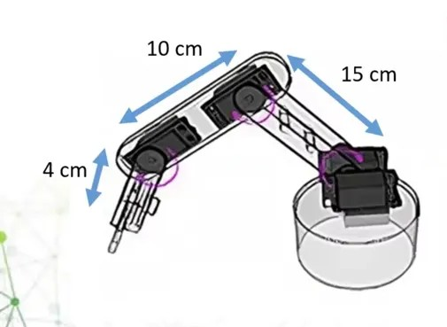

# Robot Arm Forward Kinematics 🤖

## معلومات المشروع | Project Information

هذا المشروع يحتوي على حسابات Forward Kinematics لذراع روبوت ثلاثي الأبعاد (3D) بثلاث مفاصل.

This project contains Forward Kinematics calculations for a 3D robot arm with three joints.

---

## المعطيات | Given Data

**أطوال أذرع الروبوت | Robot Arm Lengths:**
- l₁ = 15 cm (الذراع الأول | First Link)
- l₂ = 10 cm (الذراع الثاني | Second Link)
- l₃ = 4 cm (الذراع الثالث | Third Link)

  

**المتغيرات | Variables:**
- q₁: زاوية المفصل الأول (الدوران حول المحور العمودي) | First joint angle (rotation around vertical axis)
- q₂: زاوية المفصل الثاني | Second joint angle
- q₃: زاوية المفصل الثالث | Third joint angle

---

## معادلات Forward Kinematics | Forward Kinematics Equations

### المعادلات العامة | General Equations

#### الإحداثي X | X-Coordinate:
```
x = l₁cos(q₁) + l₂cos(q₁)cos(q₂) + l₃cos(q₁)cos(q₂ + q₃)
```

بالتعويض بالأطوال | With substituted lengths:
```
x = 15cos(q₁) + 10cos(q₁)cos(q₂) + 4cos(q₁)cos(q₂ + q₃)
```

#### الإحداثي Y | Y-Coordinate:
```
y = l₁sin(q₁) + l₂sin(q₁)cos(q₂) + l₃sin(q₁)cos(q₂ + q₃)
```

بالتعويض بالأطوال | With substituted lengths:
```
y = 15sin(q₁) + 10sin(q₁)cos(q₂) + 4sin(q₁)cos(q₂ + q₃)
```

#### الإحداثي Z | Z-Coordinate:
```
z = l₂sin(q₂) + l₃sin(q₂ + q₃)
```

بالتعويض بالأطوال | With substituted lengths:
```
z = 10sin(q₂) + 4sin(q₂ + q₃)
```

---

## حلول لقيم مختلفة من الزوايا | Solutions for Different Angle Values

### مجال الحركة | Range of Motion
**الزوايا من 0° إلى 90°** | **Angles from 0° to 90°**

---

### الحالة 1 | Case 1: q₁ = 0°, q₂ = 0°, q₃ = 0°

**الحسابات | Calculations:**
```
x = 15cos(0°) + 10cos(0°)cos(0°) + 4cos(0°)cos(0°)
x = 15(1) + 10(1)(1) + 4(1)(1)
x = 15 + 10 + 4 = 29 cm
```

```
y = 15sin(0°) + 10sin(0°)cos(0°) + 4sin(0°)cos(0°)
y = 15(0) + 10(0)(1) + 4(0)(1)
y = 0 + 0 + 0 = 0 cm
```

```
z = 10sin(0°) + 4sin(0°)
z = 10(0) + 4(0)
z = 0 + 0 = 0 cm
```

**النتيجة النهائية | Final Result:**
```
Position (x, y, z) = (29, 0, 0) cm
```

---

### الحالة 2 | Case 2: q₁ = 30°, q₂ = 45°, q₃ = 60°

**الحسابات | Calculations:**
```
x = 15cos(30°) + 10cos(30°)cos(45°) + 4cos(30°)cos(105°)
x = 15(0.866) + 10(0.866)(0.707) + 4(0.866)(-0.259)
x = 12.99 + 6.12 - 0.90
x ≈ 18.21 cm
```

```
y = 15sin(30°) + 10sin(30°)cos(45°) + 4sin(30°)cos(105°)
y = 15(0.5) + 10(0.5)(0.707) + 4(0.5)(-0.259)
y = 7.5 + 3.54 - 0.52
y ≈ 10.52 cm
```

```
z = 10sin(45°) + 4sin(105°)
z = 10(0.707) + 4(0.966)
z = 7.07 + 3.86
z ≈ 10.93 cm
```

**النتيجة النهائية | Final Result:**
```
Position (x, y, z) = (18.21, 10.52, 10.93) cm
```

---

### الحالة 3 | Case 3: q₁ = 45°, q₂ = 45°, q₃ = 45°

**الحسابات | Calculations:**
```
x = 15cos(45°) + 10cos(45°)cos(45°) + 4cos(45°)cos(90°)
x = 15(0.707) + 10(0.707)(0.707) + 4(0.707)(0)
x = 10.61 + 5.00 + 0
x ≈ 15.61 cm
```

```
y = 15sin(45°) + 10sin(45°)cos(45°) + 4sin(45°)cos(90°)
y = 15(0.707) + 10(0.707)(0.707) + 4(0.707)(0)
y = 10.61 + 5.00 + 0
y ≈ 15.61 cm
```

```
z = 10sin(45°) + 4sin(90°)
z = 10(0.707) + 4(1)
z = 7.07 + 4.00
z ≈ 11.07 cm
```

**النتيجة النهائية | Final Result:**
```
Position (x, y, z) = (15.61, 15.61, 11.07) cm
```

---

### الحالة 4 | Case 4: q₁ = 60°, q₂ = 30°, q₃ = 60°

**الحسابات | Calculations:**
```
x = 15cos(60°) + 10cos(60°)cos(30°) + 4cos(60°)cos(90°)
x = 15(0.5) + 10(0.5)(0.866) + 4(0.5)(0)
x = 7.5 + 4.33 + 0
x ≈ 11.83 cm
```

```
y = 15sin(60°) + 10sin(60°)cos(30°) + 4sin(60°)cos(90°)
y = 15(0.866) + 10(0.866)(0.866) + 4(0.866)(0)
y = 12.99 + 7.50 + 0
y ≈ 20.49 cm
```

```
z = 10sin(30°) + 4sin(90°)
z = 10(0.5) + 4(1)
z = 5.0 + 4.0
z ≈ 9.0 cm
```

**النتيجة النهائية | Final Result:**
```
Position (x, y, z) = (11.83, 20.49, 9.0) cm
```

---

### الحالة 5 | Case 5: q₁ = 90°, q₂ = 90°, q₃ = 90°

**الحسابات | Calculations:**
```
x = 15cos(90°) + 10cos(90°)cos(90°) + 4cos(90°)cos(180°)
x = 15(0) + 10(0)(0) + 4(0)(-1)
x = 0 + 0 + 0
x = 0 cm
```

```
y = 15sin(90°) + 10sin(90°)cos(90°) + 4sin(90°)cos(180°)
y = 15(1) + 10(1)(0) + 4(1)(-1)
y = 15 + 0 - 4
y = 11 cm
```

```
z = 10sin(90°) + 4sin(180°)
z = 10(1) + 4(0)
z = 10 + 0
z = 10 cm
```

**النتيجة النهائية | Final Result:**
```
Position (x, y, z) = (0, 11, 10) cm
```

---

## جدول ملخص النتائج | Summary Table of Results

| q₁ | q₂ | q₃ | x (cm) | y (cm) | z (cm) |
|---|---|---|--------|--------|--------|
| 0° | 0° | 0° | 29.00 | 0.00 | 0.00 |
| 30° | 45° | 60° | 18.21 | 10.52 | 10.93 |
| 45° | 45° | 45° | 15.61 | 15.61 | 11.07 |
| 60° | 30° | 60° | 11.83 | 20.49 | 9.00 |
| 90° | 90° | 90° | 0.00 | 11.00 | 10.00 |

---

## ملاحظات | Notes

- جميع الزوايا مقاسة بالدرجات | All angles are measured in degrees
- جميع المسافات بالسنتيمتر | All distances are in centimeters
- الحسابات مبنية على نظام الإحداثيات الديكارتية | Calculations are based on Cartesian coordinate system
- مجال الحركة لكل مفصل من 0° إلى 90° | Range of motion for each joint is from 0° to 90°

---

## المراجع | References

- Forward Kinematics Theory
---
